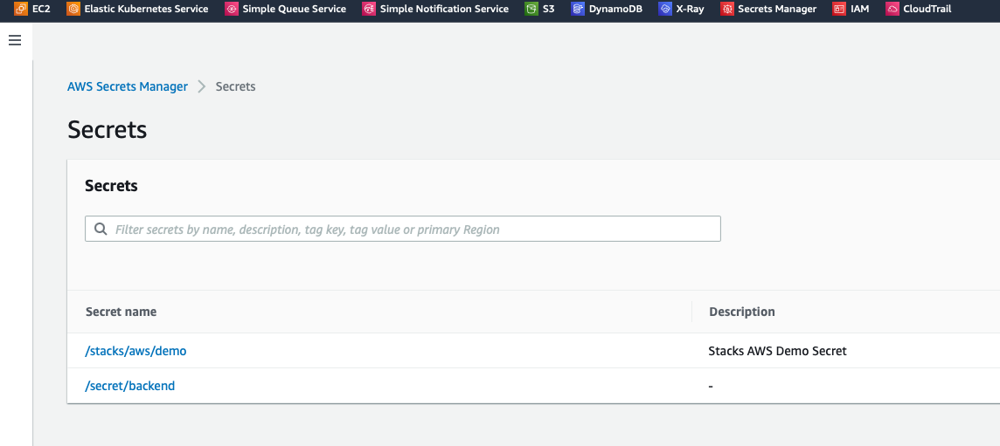
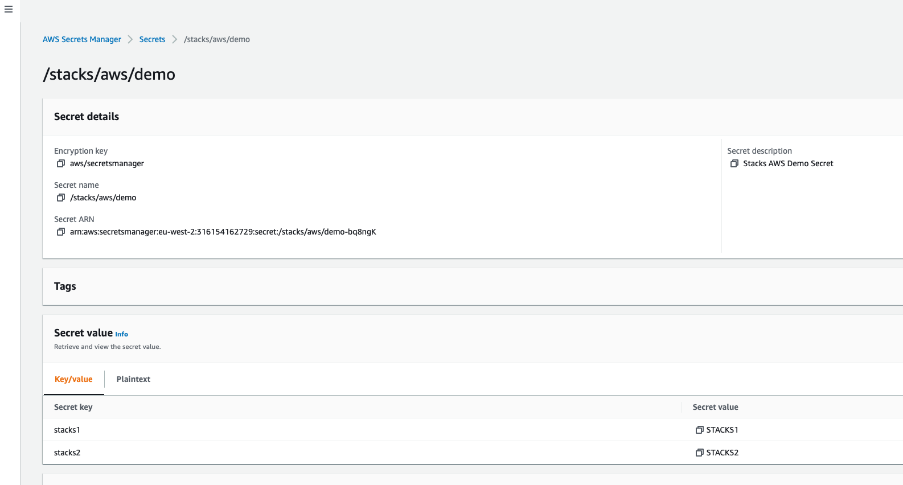
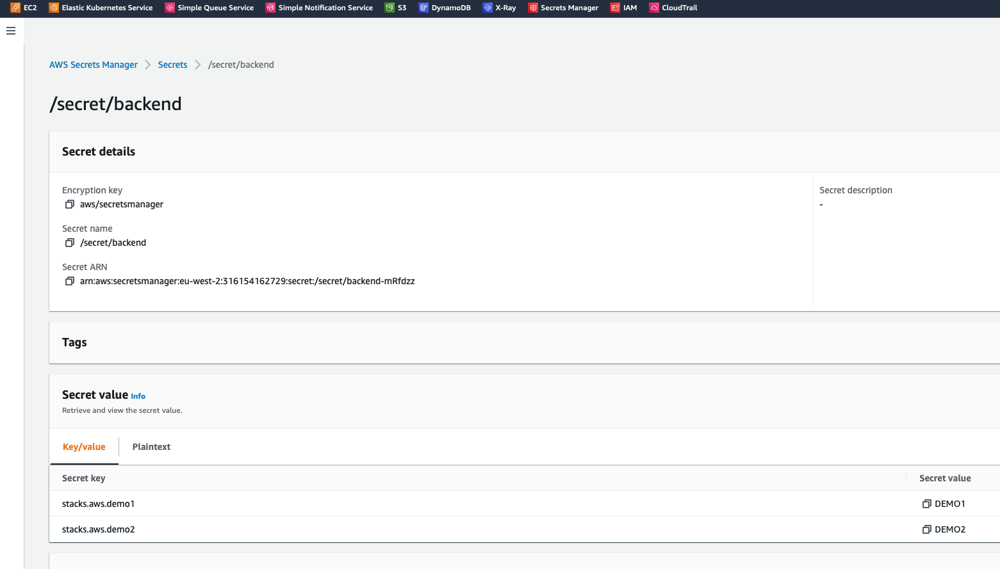

# Introduction

Shows the use of AWS Secrets as Spring property values loaded via Spring Cloud.

## AWS Secrets Manager Console



## AWS Secrets Manager - Secrets Defined





# Setting up Kubernetes

## Setup Ingress (optional - if you don't have already one in your cluster)

```shell
kubectl apply -f https://raw.githubusercontent.com/kubernetes/ingress-nginx/controller-v1.1.1/deploy/static/provider/cloud/deploy.yaml
```

## Modify /etc/host File

Add this to your hosts file :

```shell
127.0.0.1   api.example.com
```

# Authenticating with AWS locally (optional)

Before starting ensure that you have some AWS Credentials setup in `~/.aws/credentials` :

```bash
cat ~/.aws/credentials

[default]
aws_access_key_id=<AWS ACCESS KEY ID HERE>
aws_secret_access_key=<AWS SECRET ACCESS KEY HERE>
```

# Run Microservice locally (optional)

```shell
mvn clean spring-boot:run
```

# Test locally (optional)

```shell
curl localhost:8080/aws-secrets/test
```

# Build Microservice Docker image

```shell
sh build-images.sh
```

# Setup Kubernetes Environment

## Create K8S Secrets file for AWS Auth Keys

Create some content at filename = `kube-secrets/aws-auth-secrets.yaml`

Even though your AWS credentials already look like BASE64 they need to be BASE64'd again for K8S.

NOTE: Ensure that you use the -n flag e.g. `echo -n` if you do something
like `echo -n <my-data> | base64`

A sample file is provided (as `kube-secrets/aws-auth-secrets.yaml.template`) - be sure to
rename it to a yaml file.

Content :

```yaml
apiVersion: v1
data:
  aws_access_key_id: <AWS ACCESS KEY ID HERE AFTER BEING BASE64'd>
  aws_secret_access_key: <AWS SECRET ACCESS KEY HERE AFTER BEING BASE64'd>
kind: Secret
metadata:
  name: aws-secrets
```

## Start Microservices in Kubernetes

```bash
kubectl apply -f kube
```

## Some useful K8S Commands

```bash
kubectl get po
kubectl get svc
kubectl get statefulset

kubectl logs -f aws-secrets-0

# To delete resources use this
kubectl delete -f kube
kubectl delete -f kube-secrets
```

# Execute Microservice Calls against Kubernetes

```shell
curl api.example.com/aws-secrets/test
```
